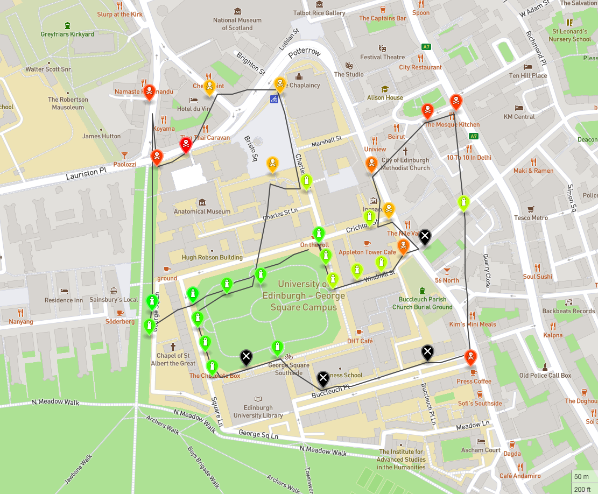
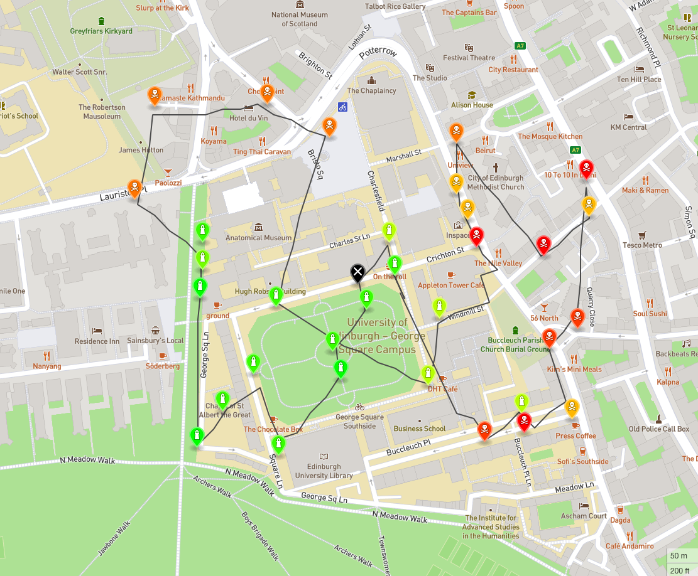

# Informatics Large Practical - CW 2 (2020 - 2021)

<b>Course Name:</b> Informatics Large Practical
<br><b>Coursework Name:</b> Air Quality Map - Aqmaps
<br><b>Objective:</b> Program a drone so that it can read information from several sensors and come back to the starting location.
<br><b>Programming Language:</b> Java 11 - Latest version with long term support available.
<br><b>Final Mark:</b> 22/25 - made a small mistake with a Maven dependency for a different Java version.
<br><b>Overall Course Mark:</b> 93/100 - Grade A1

## Files
<ul>
  <li> <a href="https://github.com/Paramiru/Aqmaps/blob/main/coursework-document.pdf">coursework-document.pdf</a> --> This pdf file contains the description followed to complete the project.
  <li> <a href="https://github.com/Paramiru/Aqmaps/blob/main/ilp-report.pdf">ilp-report.pdf</a> --> This report is made up of three sections which contain the algorithm used to program the drone, the class documentation and the software architecture used.
  <li> <a href="https://github.com/Paramiru/Aqmaps/tree/main/aqmaps">aqmaps</a> --> This directory contains the whole <em>air quality map</em> project.
  <li> <a href="https://github.com/Paramiru/Aqmaps/tree/main/WebServer">WebServer</a> --> Small web server used in the practical: you can find it in the following <a href="http://www.jibble.org/jibblewebserver.php">link</a>.
</ul>

## Brief description of the air quality map
The purpose of aqmaps is to make the drone visit a set of 33 sensors which will be fetched from the web server according to which day the drone is collecting them. This sensors simulate the level of pollution that part of the city has and they are used for a fictitious research study. 

The drone has a maximum of 150 moves it can make to visit every sensor and go back to the original position, which will be the optimal solution. You can find all the other constraints by taking a look a the coursework document.

Once the drone has visited all sensors and come back to its starting location or it does not have any move left, the program will use Mapbox Java SDK's GeoJSON module so that the map can be rendered with the drone's path plus the sensors such that their attributes (level of battery, pollution) can be easily visualized.

The aim of aqmaps is given a set of arguments corresponding to:
<ul>
  <li> a given day between 01/01/2020 and 31/12/2021 (both inclusive)</li>
  <li> a set of coordinates (which are inside the limit of the confined area stated in the courswork document)</li>
  <li> a random seed</li>
  <li> the port in which the WebServer is running</li>
</ul>

When running the application on a given day, two files will be created:

<ol>
  <li><em><b>flightpath-DD-MM-YYYY.txt</b></em> This file should be at most 150 lines long. Each line is numbered, starting at 1. It contains each move of the drone in terms of the longitude and latitude of the drone before the move, the direction it chose to move, the longitude and latitude of the drone after the move, and the location of any sensor that is connected to after the move, or null otherwise. For example, the first line of this file could be:

1,-3.1878,55.9444,110,-3.187902606042998,55.94468190778624,hurt.green.filer
 
This says that the drone was initially at (−3.1878,55.9444), then decided to move in a north-westerly direction (110 degrees) to (−3.187902606042998,55.94468190778624), and after that move was completed it connected to the sensor at What3Words location "hurt.green.filer" to take readings from that sensor for plotting on the map. </li>

  <li><em><b>readings-DD-MM-YYYY.geojson</b></em> This is a map in GeoJSON format which contains 33 markers at the locations of the 33 air-quality sensors which are specified in the file which is located on the web server at maps/YYYY/MM/DD/air-quality-data.json. Each of these markers is a GeoJSON Feature of type Point, coloured according to the convention presented in the coursework document.

In addition to these 33 markers, there is one additional Feature of type LineString, which plots the flightpath of the drone as a list of longitude,latitude pairs.

If you would like to render the map, you will have to print the JSON String which is being written to this specific file and copy it to <a href="http://geojson.io/#map=2/20.0/0.0">this website</a>.</li>
</ol>

## Getting Started

These subsections will help you get a copy of the project and understand how to run it on your local machine for development and testing purposes.
I will discuss how to clone this repository and set it up in any IDE of your choice. Furthermore, instructions on how to run the server will be given as well as how to build & run the project from the terminal.

### How to Install

The first thing you should do is clone this repository into your local machine. You can do this with the following command:
```
git clone https://github.com/Paramiru/Aqmaps
```
Once you have cloned the repository, you should check your current version of Java. I used Java 11 (LTS) for the project. You can check the version you are currently using running this command in the terminal.
```
java --version
```
It is worth mentioning that you do not have to worry about the dependencies since they are in the file pom.xml, which you can find inside the aqmaps directory. Maven will take care of downloading anything you do not currently have so that you can run the project.

If you have a previous version of Java 11, you can download it from Oracle's website.

Once you have cloned the repository, you can import the Maven project to your preferred IDE. I used Eclipse, but feel free to use whichever you are most comfortable with. 
You can check the Java version you are using for the project. In order to do that, find "JRE System Library" in the Package Explorer and select "Properties". Change "Execution environment" to be "JavaSE-11".

## Building the Project

Since I used Maven to automate the build procedure the only thing you have to do to build the project is to run the following two commands provided by Maven. If you are doing it from the terminal remember you must do so from the aqmaps' directory:
```
mvn clean
mvn package
```

Otherwise, if you are doing it from Eclipse, you can right click aqmaps' folder and you will see 
Maven > Maven clean  
Maven > Maven build (by doing this you will have to specify the goal of the build. Write "package")

## Running the Project 

Having built the project, you will see a runnable file inside the aqmaps/target folder <b>aqmaps-0.0.1-SNAPSHOT.jar</b>
Before running our file you should have the server running. Inside the WebServer directory you will find the runnable server:
```
java -jar WebServerLite.jar
```
It will be automatically run in port number 80 so you can check it is running by visiting http://localhost:80
If you want to run it in any other port, you can start it on another port, say 9898, by using the following command:
```
java -jar WebServerLite.jar /path/to/web/server/content 9898
```
Now, with the server running, run the .jar file using:
```
java -jar aqmaps-0.0.1-SNAPSHOT.jar 01 01 2020 55.9444 -3.1878 5678 80
```
where 01 01 2020 55.9444 -3.1878 5678 80 correspond to day, month, year, latitude, longitude, seed and port, respectively.
## Built With

* [Java 11](https://www.oracle.com/java/technologies/javase-jdk11-downloads.html) - Latest Java version with Long Term Support.
* [Maven](https://maven.apache.org/) - Dependency Management

## Maven Dependencies

* [Java Topology Suite (JTS)](https://locationtech.github.io/jts/javadoc/)
* [Mapbox Java SDK](https://docs.mapbox.com/android/java/guides/)
* [Java Tuples](https://www.javatuples.org)
* [Google Gson](https://www.javadoc.io/doc/com.google.code.gson/gson/latest/com.google.gson/module-summary.html)


## Screenshots

<p align="center">
  
  <br>
  Drone path on 28/12/2021
</p>

<hr>

<p align="center">
  
  <br>
  Drone path on 27/03/2020
</p>


## Authors

* **Pablo Miró** - [Paramiru](https://github.com/Paramiru)

